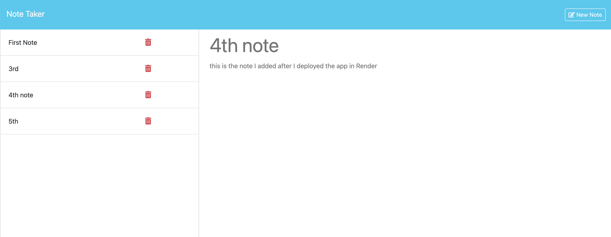

#  Note Taker

## Table of Contents
- [Description](#description)
- [Installation](#installation)
- [Usage](#usage)
- [Contributing](#contributing)
- [Tests](#tests)
- [Languages](#languages)
- [License](#license)
- [Questions](#questions)

## Description
It can be used to write and save notes. The application uses an Express.js back end and save and retrive note data from a JSON file.

## Installation
npm i

## Usage
NA

## Contributing
Cong Wang

## Tests
NA

## Languages
Javascript

## License
This application is covered under the MIT License.

## Questions
- Check my GitHub: [hydy1943cong](https://github.com/hydy1943cong)
- Email me with your questions: wangcong525@hotmail.com

## Sreenshot
Below is a screenshot of the app:

## Link to Deployed Application
[Render Page](https://note-taker-8e6d.onrender.com/notes)
    